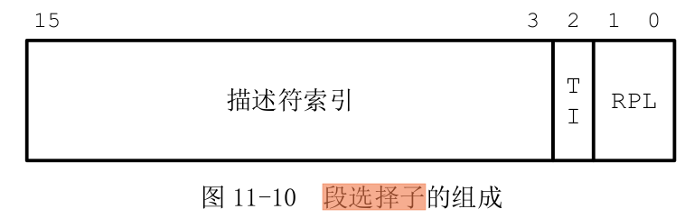

## 前言

内核从启动到正常运行，内存访问依次经历了**实模式**、**保护模式**、**分页机制** 三种，下满结合代码依次来分析这三种内存访问模式，以及内核是如何实现模式切换的。


## 实模式

代码中`boot/setup.s` 中实现了从实模式到保护模式切换， `boot/bootsec.s` 处于实模式下。


### 实模式地址访问

实模式下最多能访问 1MB 的内存空间，通用寄存器、段寄存器均为16-bit。

```assembly
BOOTSEG  = 0x07c0
INITSEG  = 0x9000

start:
        mov     ax,#BOOTSEG
        mov     ds,ax					! 设置ds为0x07c0
        mov     ax,#INITSEG
        mov     es,ax					! 设置es为0x9000
        mov     cx,#256					! 移动256次
        sub     si,si					! 清空si
        sub     di,di					! 清空di
        rep 
        movw                            ! 将数据从 DS:SI->ES:DI，移动512字节
        jmpi    go,INITSEG              ! 跳转到 INITSEG 的标号 go 处执行
go:
```

这段代码摘自`boot/bootsec.s` 。


* BIOS 在结束阶段会将磁盘第一个扇区的内容(也就是`boot/bootsec.s`)  内容拷贝到 `0x7c00` 处，并跳转到此处执行；
* `bootsec` 代码执行的时候，会先将自己搬移到 `0x90000` 处，并跳转到此处执行；
* 然后紧接着在`0x90200` 处加载`setup` 程序，在`0x10000` 处加载 `system` 程序。

上边这段代码对应`bootsec` 的自我搬移部分。


实模式下的段寄存器中内容为基地址，将**段寄存器中的基地址左移4位再跟偏移地址相加**，获取到实际的物理地址。

所以代码中将ds 设置为 `0x07c0` ，将es 设置为 `0x9000`，di，si清空，实际实现的功能是将`bootsec`从 `0x7c00` 搬移到 `0x90000`。


### 实模式切换到保护模式

从实模式切换到保护模式需要做的工作是：

* 加载中断描述符和全局描述符表

  ```assembly
  lidt    idt_48          ! load idt with 0,0
  lgdt    gdt_48          ! load gdt with whatever appropriate
  ```

* 开启A20地址线

  ```assembly
  call    empty_8042
  mov     al,#0xD1                ! command write
  out     #0x64,al
  call    empty_8042
  mov     al,#0xDF                ! A20 on
  out     #0x60,al
  call    empty_8042
  ```

* 开启保护模式标识位

  ```assembly
  mov     ax,#0x0001
  lmsw    ax
  ```


## 保护模式

### 保护模式地址访问




保护模式下的段寄存器内容为**段选择子**，段选择子中**TI** 用于标识去**全局描述符表** 还是 **局部描述符表** 寻找段描述符，找到段描述符之后根据**RPL** 检查访问权限，权限满足之后，**偏移地址** 加 **段描述符基地址** 就是实际要访问的地址。


```assembly
        lgdt    gdt_48
        jmpi    0,8             ! jmp offset 0 of segment 8 (cs)
                                ! 跳转到cs段偏移地址0的地方执行
gdt:
        .word   0,0,0,0         ! dummy
                                ! 第一个描述符，空的，不用

        .word   0x07FF          ! 8Mb - limit=2047 (2048*4096=8Mb)
        .word   0x0000          ! base address=0
        .word   0x9A00          ! code read/exec
        .word   0x00C0          ! granularity=4096, 386
                                ! 代码段

        .word   0x07FF          ! 8Mb - limit=2047 (2048*4096=8Mb)
        .word   0x0000          ! base address=0
        .word   0x9200          ! data read/write
        .word   0x00C0          ! granularity=4096, 386
                                ! 数据段

gdt_48:
        .word   0x800           ! gdt limit=2048, 256 GDT entries
        .word   512+gdt,0x9     ! gdt base = 0X9xxxx
                                ! 0x0009<<16+0x0200+gdt = 0x90200+gdt
                                ! 此时的地址是直接的物理地址，不依赖于段描述符偏移 
```

这段代码摘自`boot/setup.s`。

这段代码是从`setup` 跳转到 `system` 执行，`jmpi 0,8`，表示此时的段选择子为 8，8的二进制形式为：

```assembly
0000 0000  0000 1000
```

表示此时为全局描述符表的第一个描述符，即为代码段描述符，所以`jmpi 0,8` 意思就是跳转到代码段的 0 偏移地址处执行，由于代码段基地址是从0 开始的，且没开启分页，所以此处就是跳转到物理地址 0 处开始执行。


### 保护模式开启分页

开启分页需要：

* 设置页目录
* 设置页表
* 设置cr3寄存器
* 设置cr0 分页使能标志


## 分页机制


使能分页之后，通过保护模式获取的地址需要进一步经过分页才能找到实际的物理地址。

可以通过简单的二级映射理解分页的机制。


此时程序访问的地址为**虚拟地址**，经过分段转换之后的地址称为**线性地址**，**线性地址** 通过分页机制转换成实际的**物理地址**。